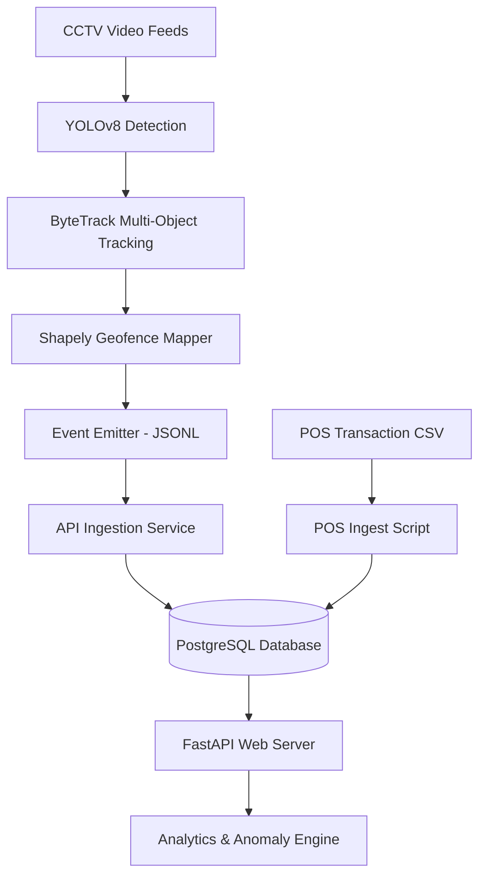

# StoreLens Pipeline Specification

This document provides a detailed specification of the **StoreLens** pipeline. It details the steps taken to process raw CCTV footage streams and cashier POS transactions, map shopper behavior across departments, classify staff vs. customer profiles, and trigger business anomalies.

---

## 1. Pipeline Architecture Overview

The system operates on an edge-to-cloud architecture consisting of three main phases:
1. **Edge Computer Vision Pipeline**: Decodes video frames, runs person detection (YOLOv8), tracks customer paths (ByteTrack), checks doorway crossings, and runs geofencing logic (Shapely).
2. **Database Ingestion API**: A FastAPI service that accepts batch shopper events and correlates them with cashier sales receipts ingested from the Point-of-Sale (POS) system.
3. **Analytics & Anomaly Engine**: Aggregates visitor metrics, builds conversion funnels, maps zone dwell-time heatmaps, and runs background logic to detect store bottleneck anomalies.

---

## 2. Customer vs. Staff Distinction

Distinguishing cash register personnel and floor workers from actual customers is critical to preventing conversion rate degradation (since employees do not make purchases). StoreLens uses a **hybrid classification system**:

### A. Spatial Counter Heuristics (Primary)
The cash register desk is located in the upper region of the cash counter camera frame (**CAM 5**). 
* **Rule**: If a tracked person's centroid coordinates place them in the top 20% of the vertical frame height (`y_center_pct < 0.2`) and they remain visible for more than 10 frames (`frame_count > 10`), they are immediately classified as **Staff** (`is_staff = True`).
* **Benefit**: Zero-latency spatial override that does not consume GPU threads.

### B. Deep Learning Classifier (Secondary Fallback)
For aisle roaming or verification, the system uses a convolutional neural network (CNN) image classifier:
* **Model**: **EfficientNet-B0** (pretrained via `torchvision.models.efficientnet_b0`).
* **Adaptation**: The original final classifier layer is replaced with a custom linear layer mapping the 1280 feature embeddings to 2 classes: `[Customer, Staff]`.
* **Execution**: During inference, the crop patch of the tracked shopper is scaled to $224 \times 224$ pixels, normalized, and run through the network to generate probability weights.

---

## 3. Geofencing & Vector Line-Crossing Math

To register shopper movements without hardcoded offsets, the pipeline relies on coordinate math:

### A. Doorway Entry/Exit Vector Check
The doorway camera (**CAM 1**) has a virtual boundary segment $L_1 L_2$. For every frame, the pipeline checks whether the line segment connecting a shopper's *previous frame center* ($P_{\text{prev}}$) to their *current center* ($P_{\text{curr}}$) intersects $L_1 L_2$ using vector cross-products:

$$\text{cross\_product}(A, B, C) = (B_x - A_x) \times (C_y - A_y) - (B_y - A_y) \times (C_x - A_x)$$

If they intersect:
* A **negative** cross-product indicates crossing from the exterior to the interior $\rightarrow$ **`ENTRY`** event.
* A **positive** cross-product indicates crossing from the interior to the exterior $\rightarrow$ **`EXIT`** event.

### B. Shelf Department Geofencing
Store departments (`skin`, `makeup`, `bath-and-body`, and `BILLING`) are defined as polygonal coordinates scaled between `0.0` and `1.0`. The pipeline scales these coordinate bounds to the current frame size and maps them using `shapely.geometry.Polygon`:
* **`ZONE_ENTER`**: Emitted when a shopper's center point transitions from outside to inside the polygon.
* **`ZONE_EXIT`**: Emitted when they leave the polygon boundaries.
* **Flushing Mechanism**: If a shopper's track is lost (e.g. they walk out of frame or the video ends), any active shelf zone states are automatically flushed as a `ZONE_EXIT` with their cumulative dwell duration.

---

## 4. Point-of-Sale (POS) Receipt Correlation

To link physical shoppers with the purchases recorded in the checkout database, the platform employs a temporal join query. When a customer joins the register queue, a `BILLING_QUEUE_JOIN` event is recorded. This event is joined to a completed `pos_transactions` ticket if:
1. The transaction occurs at the same store (`store_id`).
2. The CV event's timestamp is within a **5-minute window** leading up to the final purchase timestamp:

$$\text{event\_timestamp} \in [\text{transaction\_timestamp} - 5\text{ mins}, \text{transaction\_timestamp}]$$

This temporal window accommodates the time spent ringing up items and processing payment methods.

---

## 5. Anomaly Detection Specification

The `AnomalyEngine` runs background checks against PostgreSQL and Redis records to flag operational failures:

| Anomaly Type | Severity | Condition | Suggested Action |
| :--- | :--- | :--- | :--- |
| **`QUEUE_SPIKE`** | `WARN` | Checkout queue depth sustained at $> 5$ over the last 5 minutes (requires $\ge 3$ consecutive high samples). | Open additional billing counters immediately. |
| **`CONVERSION_DROP`** | `CRITICAL` | Today's store checkout conversion rate falls below $70\%$ of the historical 7-day average (requires $> 10$ daily visitors). | Review checkout staffing, floor assistance, or aisle layouts. |
| **`DEAD_ZONE`** | `INFO` | A department zone (e.g., `skin`, `makeup`) records zero visitor entries in the last 30 minutes. | Verify camera alignment, department signage, or merchandise displays. |
| **`TRAFFIC_SURGE`** | `WARN` | Current hourly store entries exceed $2\times$ the historical hourly average over the last 7 days (requires $> 5$ entries). | Alert floor personnel to assist with increased shopper volume. |

---

## 6. End-to-End Walkthrough Summary

1. **Detection**: Bounding boxes are generated by YOLOv8n and associated frame-to-frame by ByteTrack.
2. **Event Emission**: Coordinates are checked against geofences. Transition events (Entry, Exit, Zone Enter/Exit) are written to `events_real.jsonl`.
3. **Ingestion**: `ingest_pos_data.py` reads checkout transactions, while `ingest_events.py` streams CV events to `/api/v1/events/ingest`.
4. **Caching & Queries**: Complex queries are computed dynamically using CTE joins, and saved into Redis with a 60-second TTL to keep API response times under 5 milliseconds.
5. **Monitoring**: Dashboards query `/anomalies` to track operational metrics.
